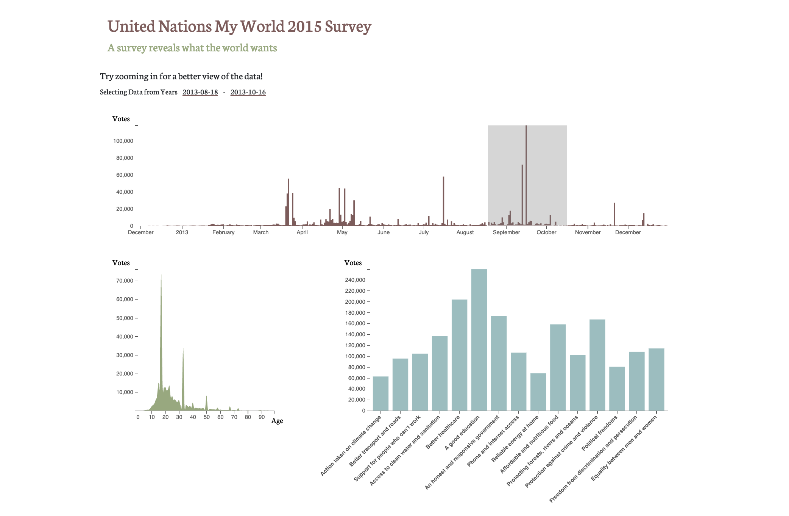

# UN-my-world-survey-vis
Lab work for CS171 course in Data Visualization with D3, taught at the Harvard Extension School.

### Lab 9 
November 17, 2019

Practicing linked views with event handling in jQuery, plus brushing and linking 
with the main graph on top.

You can select a time slice on the timeline 
on the top graph and the two graphs on the bottom will
automatically update to show data from just that segment:

